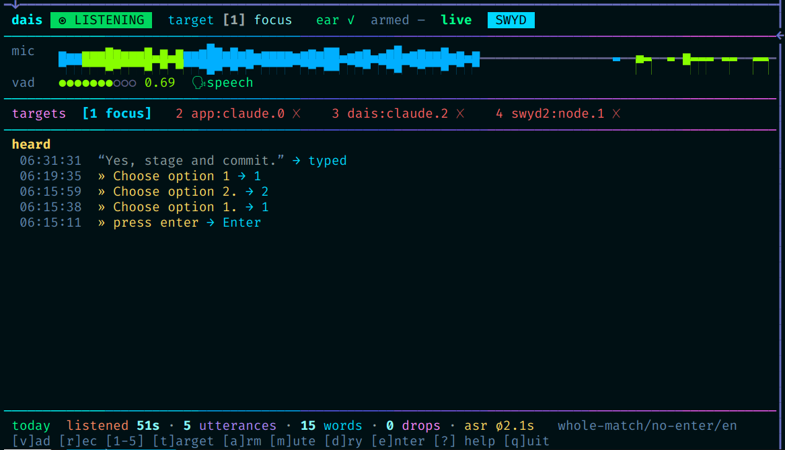

# dais — Do As I Say

Personal Linux voice control for controlling TUI coding agents for Linux.

Dais transcribes locally and routes each uttterance as either a **command**
or **dictation**. The output is delivered to a tmux pane or the focused app.

The core idea here is that the agent receiving the voice input can clean up the transcript. All that's needed is to inform the agent about it, and for this there's the brief prompt for that.



```text

mic · VAD · transcription
          |
       daemon  --> commands   ---\
          |                      |
          \------> dictation  -------> tmux paste / ydotool

```

Primary motivation: hands-free coding in the car

- [dais](https://github.com/Kynde/dais) voice controls an agent session
- [airc](https://github.com/Kynde/airc) Tmux remote control supporting remote viewing in a browser (e.g. Tesla) and has Android app for also controlling.

Deprecated

- [swyd](https://github.com/Kynde/swyd) First phase tmux viewer written for Tesla's browser. The features were merged into airc, and swyd is now deprecated.

## Run

```sh
systemctl --user start dais      # unit: tools/dais.service (enabled here)
tools/dais-ctl status
tools/dais-vad                   # open mic; say "voice off" to stop
```

See `tools/README.md` for the tools and the voice-command reference.

## Reading order

- `FABLE_PLAN.md` — design decisions with rationale, milestone status.
- `tools/README.md` — usage, examples, voice commands.
- `BRIEF.md` — the notice a driven agent should read (`dais-ctl brief`).
- `AGENTS.md` + `ai/` — for coding agents working on this repo.
- `GOAL.md`, `CODEX_PLAN.md` — original goal notes and an alternative plan.
